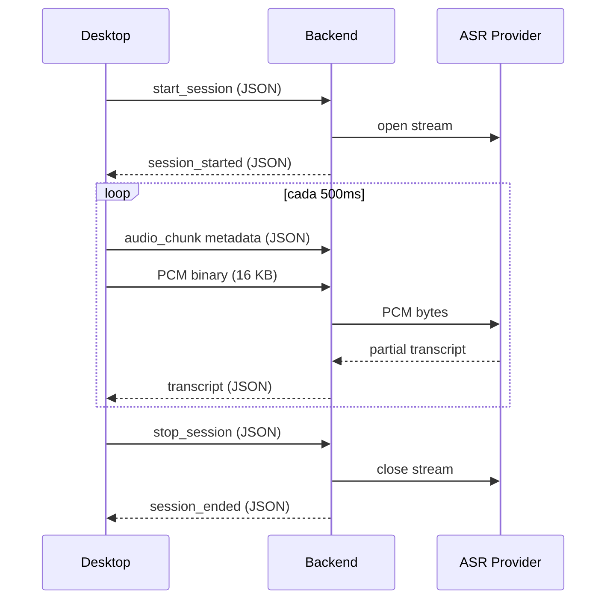

# WebSocket Protocol Schema — SpeakFlow Desktop ↔ Backend

Protocolo binario: **JSON metadata + audio PCM binario** (sin base64).

---

## Cliente → Servidor

### 1. `start_session` (al iniciar captura)

**Tipo:** JSON text frame

```json
{
  "type": "start_session",
  "session_id": "550e8400-e29b-41d4-a716-446655440000",
  "user_id": "user123",
  "sources": ["microphone", "system"],
  "audio_config": {
    "sample_rate": 16000,
    "channels": 1,
    "encoding": "pcm16le"
  }
}
```

| Campo           | Tipo     | Descripción |
|-----------------|----------|-------------|
| `type`          | string   | `"start_session"` |
| `session_id`    | string   | UUID de la sesión |
| `user_id`       | string   | ID del usuario (mismo que header `X-User-Id`) |
| `sources`       | string[] | Lista de fuentes: `["microphone", "system"]` |
| `audio_config`  | object   | Configuración de audio |
| ↳ `sample_rate` | number   | 16000 |
| ↳ `channels`    | number   | 1 (mono) |
| ↳ `encoding`    | string   | `"pcm16le"` (PCM signed 16-bit little-endian) |

**Cuándo se envía:**
- Al pulsar Start en la UI
- Al reconectar si la sesión aún está activa

---

### 2. `audio_chunk` (cada 500 ms, por fuente)

**Frames alternados:** JSON metadata → binario PCM

#### Frame 1: Metadata (JSON text frame)

```json
{
  "type": "audio_chunk",
  "session_id": "550e8400-e29b-41d4-a716-446655440000",
  "source": "microphone",
  "timestamp": 1717000000123,
  "size": 16000
}
```

| Campo        | Tipo   | Descripción |
|--------------|--------|-------------|
| `type`       | string | `"audio_chunk"` |
| `session_id` | string | UUID de la sesión |
| `source`     | string | `"microphone"` o `"system"` |
| `timestamp`  | number | **ms epoch** del primer sample del chunk |
| `size`       | number | Bytes del frame binario que sigue (típico: 16 000) |

#### Frame 2: Audio PCM (binary frame)

Inmediatamente después de la metadata, un frame **binario** con el audio:

- **Formato:** PCM signed 16-bit little-endian
- **Canales:** 1 (mono)
- **Sample rate:** 16 000 Hz
- **Duración:** ~500 ms → **8 000 muestras** → **16 000 bytes**

**Decodificación en Python:**

```python
import struct

# Recibir alternado
metadata_raw = await websocket.receive_text()
meta = json.loads(metadata_raw)

if meta["type"] == "audio_chunk":
    pcm_bytes = await websocket.receive_bytes()  # 16 000 bytes
    samples = struct.unpack(f"<{len(pcm_bytes)//2}h", pcm_bytes)  # 8 000 muestras Int16
```

**Ritmo:** ~2 chunks/segundo × 2 fuentes = **4 frames JSON + 4 frames binarios/s**

---

### 3. `stop_session` (al detener captura)

**Tipo:** JSON text frame

```json
{
  "type": "stop_session",
  "session_id": "550e8400-e29b-41d4-a716-446655440000"
}
```

| Campo        | Tipo   | Descripción |
|--------------|--------|-------------|
| `type`       | string | `"stop_session"` |
| `session_id` | string | UUID de la sesión |

**Cuándo se envía:**
- Al pulsar Stop en la UI

---

## Servidor → Cliente

El backend puede enviar mensajes JSON en cualquier momento:

### 1. `session_started` (confirmación)

```json
{
  "type": "session_started",
  "session_id": "550e8400-e29b-41d4-a716-446655440000"
}
```

### 2. `transcript` (transcripción parcial o final)

```json
{
  "type": "transcript",
  "session_id": "550e8400-e29b-41d4-a716-446655440000",
  "source": "microphone",
  "text": "Hola, ¿cómo estás?",
  "is_final": false,
  "timestamp": 1717000001234
}
```

| Campo        | Tipo    | Descripción |
|--------------|---------|-------------|
| `type`       | string  | `"transcript"` |
| `session_id` | string  | UUID de la sesión |
| `source`     | string  | `"microphone"` o `"system"` |
| `text`       | string  | Texto transcrito |
| `is_final`   | boolean | `true` si es transcripción final; `false` si es parcial |
| `timestamp`  | number? | Opcional: ms epoch cuando se generó la transcripción |

### 3. `session_ended` (confirmación de cierre)

```json
{
  "type": "session_ended",
  "session_id": "550e8400-e29b-41d4-a716-446655440000"
}
```

### 4. `error` (errores)

```json
{
  "type": "error",
  "code": "provider_unavailable",
  "message": "Deepgram connection lost",
  "session_id": "550e8400-e29b-41d4-a716-446655440000"
}
```

| Campo        | Tipo    | Descripción |
|--------------|---------|-------------|
| `type`       | string  | `"error"` |
| `code`       | string  | Código de error (e.g., `invalid_audio`, `provider_unavailable`) |
| `message`    | string  | Mensaje legible |
| `session_id` | string? | Opcional: sesión afectada |

---

## Headers WebSocket (handshake HTTP)

| Header       | Valor                     | Descripción |
|--------------|---------------------------|-------------|
| `X-User-Id`  | e.g., `"user123"`         | User ID del cliente (v1 sin JWT) |

**Futuro (v2):**

| Header          | Valor                     |
|-----------------|---------------------------|
| `Authorization` | `Bearer <jwt-token>`      |

---

## Resumen de la secuencia



---

## Ejemplo completo FastAPI

```python
from fastapi import FastAPI, WebSocket
import json

app = FastAPI()

@app.websocket("/ws/audio")
async def audio_endpoint(websocket: WebSocket):
    user_id = websocket.headers.get("x-user-id")
    if not user_id:
        await websocket.close(code=4401)
        return

    await websocket.accept()
    session_id = None

    try:
        while True:
            raw = await websocket.receive_text()
            msg = json.loads(raw)

            if msg["type"] == "start_session":
                session_id = msg["session_id"]
                # Abrir conexión con Deepgram/AssemblyAI
                await websocket.send_text(json.dumps({
                    "type": "session_started",
                    "session_id": session_id
                }))

            elif msg["type"] == "audio_chunk":
                # Siguiente frame es binario
                pcm_bytes = await websocket.receive_bytes()
                # Enviar a ASR provider
                # await asr_provider.send(pcm_bytes)

            elif msg["type"] == "stop_session":
                # Cerrar conexión ASR
                await websocket.send_text(json.dumps({
                    "type": "session_ended",
                    "session_id": session_id
                }))
                break

    except Exception as e:
        await websocket.send_text(json.dumps({
            "type": "error",
            "code": "internal_error",
            "message": str(e)
        }))
```

---

## Ventajas del protocolo binario

| Métrica              | Base64 (antes) | Binario (ahora) | Mejora |
|----------------------|----------------|-----------------|--------|
| Tamaño por chunk     | ~21.4 KB       | ~16.1 KB        | -25%   |
| Bandwidth (4 ch/s)   | ~680 Kbps      | ~512 Kbps       | -25%   |
| Decode overhead      | Sí (base64)    | No              | ✅     |
| Compatible ASR APIs  | Conversión     | Directo         | ✅     |
